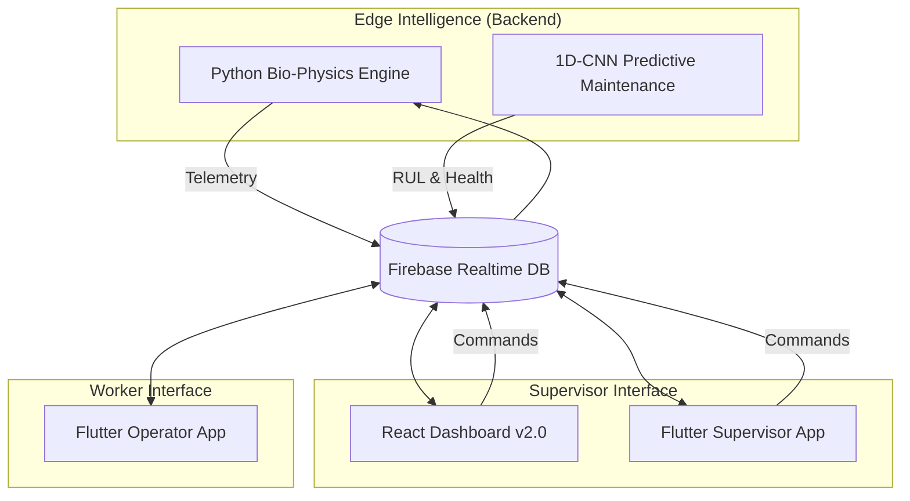

# 🌌 Harmony Aura: Enterprise Safety Overwatch

> **Next-Generation Industrial Safety & Predictive Maintenance Ecosystem.**

Harmony Aura is a high-fidelity, production-grade industrial monitoring platform designed to merge workforce biometrics with heavy machinery telemetry. It provides a real-time "Overwatch" capability for site supervisors, enabling proactive intervention before accidents happen.

---

## 🏗️ System Architecture

Harmony Aura operates as a unified four-pillar ecosystem, synchronized via a centralized **Firebase Realtime Uplink**.



---

## 💎 Key Modules

### 1. **Cognitive Intelligence Score (CIS)**
The core decision engine of Harmony Aura. It calculates a high-precision risk factor (0.0 - 1.0) by correlating worker physiological stress with machine operating state.
- **Formula**: `CIS = (0.55 * Human_Risk) + (0.45 * Machine_Risk)`
- **Safety Levels**: `Safe (<0.40)`, `Warning (0.40-0.75)`, `Critical (>0.75)`

### 2. **AI Predictive Maintenance (PdM)**
Utilizes a **1D Convolutional Neural Network** trained on time-series vibration and thermal data to predict Remaining Useful Life (RUL) and detect serious faults 60 ticks before they occur.

### 3. **Closed-Loop Command System**
Supervisors can dispatch mandatory breaks or operating load caps directly from the Dashboard/App. These commands are executed by the edge simulation in real-time.

---

## 🛠️ Tech Stack

| Layer | Technologies |
| :--- | :--- |
| **Edge Simulation** | Python 3.9, NumPy, TensorFlow 2.15 |
| **Web Dashboard** | React 19, Vite, Tailwind CSS v4, GSAP |
| **Mobile Apps** | Flutter 3.x, Dart |
| **Data Backbone** | Firebase Realtime Database, Cloud Messaging |
| **Hardware Proto** | Bluetooth LE (Wearables), J1939 CAN-bus (Simulation) |

---

## 🏭 Production & Hardware Integration

While the current repository utilizes a high-fidelity physics simulator, Harmony Aura is designed for direct hardware swapping.

### 📡 1. Workforce Biometrics (Operator)
- **Production**: Replace `simulation.py` bio-profile with **Apple HealthKit** or **Garmin Wellness SDK** integrations.
- **Sensors**: Photoplethysmogram (PPG) for Heart Rate/HRV, Galvanic Skin Response (GSR) for stress.

### 🚜 2. Machine Telemetry (Equipment)
- **Production**: Interface with the machine's **CAN-bus (J1939)** via an OBD-II or dedicated industrial IoT gateway (e.g., Teltonika DOT).
- **Sensors**: Thermocouples (Coolant/Oil), Tri-axial Accelerometers (Vibration), Pressure Transducers.

### 🌐 3. Data Transmission
- **Edge**: IoT Gateways running Python/C++ to pre-process data before uplink.
- **Connectivity**: Private 5G or LoRaWAN for deep-mine/remote site coverage.

---

## 📦 Getting Started

### Prerequisites
- Node.js v18+ & Python 3.9+
- Firebase Project with Realtime Database enabled

### Quick Start
1. **Clone & Install**:
   ```bash
   git clone https://github.com/ntbnaren7/harmony-aura-web-dashboard.git
   cd harmony-aura-web-dashboard
   ```
2. **Backend**: Install Py-deps in `/backend` and run `python simulation.py`.
3. **Web**: Install deps in `/frontend` and run `npm run dev`.
4. **Mobile**: Run `flutter run` in `/mobile` and `/mobile_operator`.

---

## 📂 Internal Documentation
- [**Backend Engine**](./backend/README.md): Math models and PdM logic.
- [**Web Dashboard**](./frontend/README.md): UI/UX and React architecture.
- [**Supervisor Mobile**](./mobile/README.md): Alerting and commands.
- [**Operator Mobile**](./mobile_operator/README.md): Vitals and rest requests.

---
*Developed for Industrial Excellence. Built for Safety.*
