# 🌌 Harmony Aura: Enterprise Safety Overwatch

> **Next-Generation Industrial Safety & Predictive Maintenance Ecosystem.**

Harmony Aura is a high-fidelity, production-grade industrial monitoring platform designed to merge workforce biometrics with heavy machinery telemetry. By utilizing **Edge Intelligence** and **Digital Twin** technology, it provides a real-time "Overwatch" capability for site supervisors, enabling proactive intervention before accidents happen.

---

## 🏗️ System Architecture (Design 2.0)

Harmony Aura operates as a unified multi-pillar ecosystem, synchronized via a centralized **Firebase Realtime Uplink**.

```mermaid
graph TD
    subgraph "🛠️ IoT & Edge Layer"
        W_S["ESP32 Wearable<br/>(E2EE / AES-256)"]
        S3_E["ESP32-S3 Edge Node<br/>(Data Fusion Engine)"]
    end

    subgraph "☁️ Cloud & Analytics"
        DB[("🔥 Firebase<br/>Realtime DB")]
        BE["🐍 Python Engine<br/>(Bio-Physics Simulation)"]
        AI["🧠 AI Module<br/>(1D-CNN PdM)"]
    end

    subgraph "🖥️ Monitoring Layer"
        DASH["⚛️ React Dashboard<br/>(GSAP / Tailwind v4)"]
        SUP["💙 Flutter Supervisor<br/>(Alerting Console)"]
        OPR["🧡 Flutter Operator<br/>(Safety HUD)"]
    end

    W_S -->|Secure Vitals| S3_E
    S3_E -->|Fused Telemetry| DB
    BE <-->|State Sync| DB
    AI <-->|Inference| DB
    DB <--> DASH
    DB <--> SUP
    DB <--> OPR

    %% Styling
    style DB fill:#ff8c00,stroke:#333,stroke-width:2px;
    style S3_E fill:#4b0082,color:#fff;
    style AI fill:#00ced1,color:#000;
```



---

## 💎 Core Capabilities

### 1. **Cognitive Intelligence Score (CIS)**
The "Safety Pulse" of the system. It calculates a high-precision risk factor (0.0 - 1.0) by correlating worker physiological stress with machine operating state.
- **Formula**: `CIS = (0.55 * Human_Risk) + (0.45 * Machine_Risk)`
- **Safety Levels**: `🟢 Safe (<0.40)`, `🟡 Warning (0.40-0.75)`, `🔴 Critical (>0.75)`

### 2. **Digital Twin Fusion**
Combines real hardware sensor data (Heart Rate, Temp, Vibration) with **Synthetic Intelligence** (SpO2, Ambient Noise, Wind Speed) to create a complete situational picture.

### 3. **AI Predictive Maintenance (PdM)**
A Deep Learning module using a **1D Convolutional Neural Network** (1D-CNN) trained on time-series vibration data to predict Remaining Useful Life (RUL) and detect faults before they occur.

---

## 🛠️ Tech Stack

| Layer | Technologies |
| :--- | :--- |
| **IoT & Edge** | ESP32, ESP32-S3, Arduino/C++, MbedTLS (AES-256-GCM) |
| **Simulation Engine** | Python 3.9, NumPy, Google Firebase Admin SDK |
| **AI / Machine Learning** | TensorFlow 2.15, Scikit-Learn (1D-CNN) |
| **Web Dashboard** | React 19, Vite, Tailwind CSS v4, GSAP, Lucide Icons |
| **Mobile Strategy** | Flutter 3.x, Dart (Supervisor & Operator Apps) |
| **Backend / DB** | Firebase Realtime Database, Cloud Messaging |

---

## 📂 Project Structure

```bash
harmony-aura-os/
├── 📁 backend/          # Python Bio-Physics Engine & AI Logic
├── 📁 frontend/         # Mission-Critical Supervisor Dashboard
├── 📁 iot/              # Hardware/Firmware (Wearable & Edge Node)
├── 📁 landing-page/     # Enterprise Promotional & Intro Site
├── 📁 mobile/           # Flutter Supervisor Application
└── 📁 mobile_operator/  # Flutter Operator HUD Application
```

---

## 🚀 Getting Started

### Prerequisites
- Node.js v18+ & Python 3.9+
- Firebase Project with Realtime Database enabled
- Arduino IDE (for IoT modules)

### Installation
1. **Clone & Install**:
   ```bash
   git clone https://github.com/ntbnaren7/harmony-aura-os.git
   cd harmony-aura-os
   ```
2. **Backend**: Navigate to `/backend`, run `pip install -r requirements.txt`.
3. **Frontend**: Navigate to `/frontend`, run `npm install`.
4. **Mobile**: Run `flutter pub get` in both mobile directories.

---

## 🏭 Road to Production
Harmony Aura is designed for seamless hardware transition.
- **Biometrics**: Designed to swap Python simulations for **Apple HealthKit** or industrial PPG sensors.
- **Machines**: Architecture supports **J1939 CAN-bus** integration over physical IoT gateways.

---
*Developed for Industrial Excellence. Built for Human Safety.*
