# ⚙️ Harmony Aura: Simulation & Logic Engine

The Harmony Aura Backend is a high-fidelity **Digital Twin** engine. It bridges the gap between raw hardware telemetry and actionable safety intelligence by utilizing stochastic biological modeling and deep learning for predictive maintenance.

---

## 🏗️ System Design: The Logic Loop

```mermaid
graph LR
    subgraph "🧬 Data Generation"
        W[Worker Bio-Model]
        M[Machine Physics-Model]
    end

    subgraph "🧠 Intelligence"
        CIS[CIS Fusion Engine]
        PdM[1D-CNN AI Inference]
    end

    W -->|Raw BPM/Stress| CIS
    M -->|Thermal/Vib| CIS
    M -->|Telemetry Stream| PdM
    CIS -->|Safety Score| FB[(Firebase)]
    PdM -->|RUL / Failures| FB
```

---

## 🧬 Physiological Modeling (Human)

To simulate a workforce, the engine generates unique biological profiles based on worker IDs.

### 1. **Baseline Generation**
Each worker is assigned a **Biological DNA Profile**:
- **Baseline HR**: `N(72, 8)` BPM.
- **Fatigue Coeff**: `0.6 - 1.4` (determines how fast stress accumulates).

### 2. **Stochastic Fluctuations**
We utilize the **Ornstein-Uhlenbeck (OU) Process** to simulate realistic, mean-reverting biological telemetry. This prevents "jitter" and ensures readings behave like real medical signals:
- `dx_t = θ(μ - x_t)dt + σdW_t`
- **Mean Reversion (θ)**: Ensures BPM returns to baseline after a burst of activity.
- **Volatility (σ)**: Adds natural heart rate variability (HRV).

---

## 🏗️ Physics Modeling (Machine)

Machines are simulated using first-order differential equations for thermal and load dynamics.

### 1. **Thermal Dynamics**
Coolant temperature change is modeled as:
- `ΔT_coolant = (Heat_Gen - Heat_Loss) * Δt`
- **Heat_Gen**: Proportional to `Engine_Load * Friction_Factor`.
- **Heat_Loss**: `(T_coolant - T_ambient) * Cooling_Efficiency`.

### 2. **Degradation Model**
Machine health decays non-linearly over time:
- `Health_t+1 = Health_t - (Load^2 * Vibration * Wear_Constant)`

---

## 🧠 Intelligence Modules

### 1. **CIS Score (Cognitive Intelligence Score)**
The core safety metric that correlates human stress with machine instability.
- **Formula**: `CIS = (0.55 * HumanRisk) + (0.45 * MachineRisk)`
- **HumanRisk**: Weighted average of `HR_Risk`, `HRV_Risk`, and `Fatigue_Level`.
- **MachineRisk**: Weighted average of `Thermal_Stress` and `Vibration_Severity`.

### 2. **AI Predictive Maintenance (PdM)**
- **Architecture**: **1D Convolutional Neural Network (1D-CNN)**.
- **Input Array**: `60 x 6` (Last 60 ticks of RPM, Load, Temp, Vib, Oil, Ambient).
- **Inference Pipeline**:
    1. Reshape sliding window into `(1, 60, 6)`.
    2. Conv1D Layer (32 filters) -> MaxPooling -> Dense.
    3. Output: Categorical Failure Prediction (`Healthy`, `Minor Fault`, `Critical RUL`).

---

## 🛠️ Tech Stack
- **Language**: Python 3.9+
- **Numerical Processing**: NumPy, Pandas.
- **Machine Learning**: TensorFlow 2.15, Scikit-Learn.
- **Uplink**: Firebase Admin SDK (Service Account driven).

---
*Precision Monitoring for Critical Environments.*
