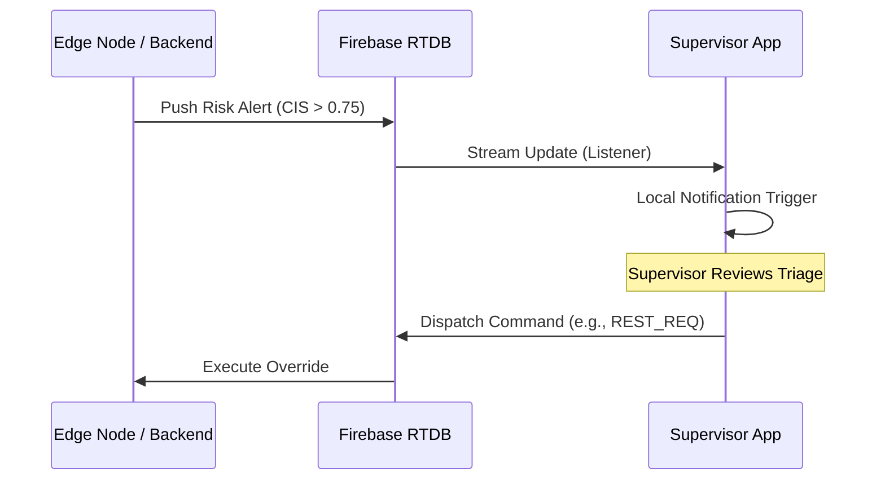

# 📱 Harmony Aura: Supervisor Mobile Console

The Harmony Aura Supervisor App is a high-performance **Flutter** application that serves as the mobile "Command Center" for industrial site managers. It provides real-time alerts, workforce oversight, and direct intervention capabilities in the palm of your hand.

---

## 🏗️ Technical Architecture: The Command Loop

The app operates on a **Reactive Listener Pattern**, ensuring that supervisors are notified of risks within milliseconds of their detection at the edge.



---

## 🚀 Key Features

### 1. **Risk Triage & Alerts**
- **Deep Visibility**: View exactly which telemetry points triggered the alert (e.g., "Heart Rate peaked at 145 BPM during Engine Overload").
- **Intervention HUD**: Direct buttons to dispatch "Immediate Rest" or "Machine Load Cap" commands.

### 2. **Break Management Workflow**
- Receives and triages incoming rest requests from the `Operator App`.
- Displays a "Snapshot" of the worker's vitals at the time of request to inform the approval process.

### 3. **Fleet Health Real-time Grid**
- A high-contrast, easy-to-read list of all active personnel and their assigned machinery status.

---

## 🎨 Design System
- **High-Contrast Dark Mode**: Optimized for low-light industrial environments.
- **Safety Specific Color-Coding**: Consistent with the Web Dashboard (Safe/Warning/Critical).

---

## 🛠️ Setup & Execution

1. **Install Flutter SDK**: Ensure you are on Flutter 3.x.
2. **Fetch Packages**:
   ```bash
   flutter pub get
   ```
3. **Run Environment**:
   ```bash
   flutter run --dart-define=FIREBASE_API_KEY=YOUR_KEY
   ```

---
*Command and Control. Anywhere on site.*
